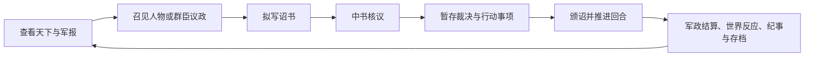
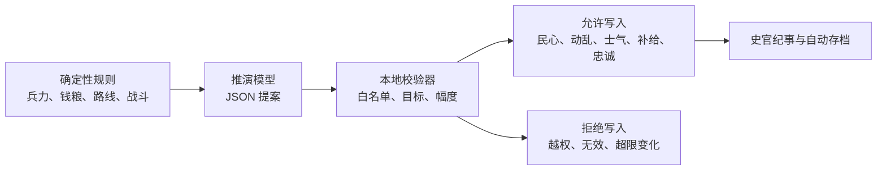

# 安史之乱：中唐续命

> 从天宝十五载潼关危局开始，用对话、诏书与军政决策，尝试把一台正在失序的唐朝国家机器重新运转起来。


这是一个联网的、对话驱动的历史策略游戏原型。玩家扮演大唐最高决策者：召见人物、组织群臣议政、暂存御前裁决、自由拟写诏书，再把军令、钱粮、人事与地方局势推进到下一回合。

它的重点不是让模型替玩家写一段历史小说，而是让 AI 进入一个有边界的游戏循环：**模型负责人物表达与世界反应，本地规则负责权威状态与结算。**

## 当前内容

| 内容 | 当前规模 |
| --- | ---: |
| 战役主线 | 5 幕，756—763 |
| 可召见人物与立绘 | 42 |
| 战略地区 | 16 |
| 跨幕军队 | 13 |
| 战役事件节点 | 18 |
| 场景背景 | 9 |
| 事件插图 | 16 |
| 自动化测试 | 31 项 |


## 玩家实际在玩什么



### 对话不是装饰

- **朝堂**：人物顾及官位、名分、派系与在场同僚。
- **密诏**：人物可以谈不宜公开的判断，关系与承诺会跨回合保留。
- **远奏**：军镇人物只能基于地方见闻回答，也会承认消息迟滞。
- **群议**：后发言者能读取前臣意见，在人设和利益约束下附和或反驳。

### 诏书与裁决不是点一下就生效

玩家自由写下旨意后，文书模型会先把它润色为唐廷风格圣旨，再输出 JSON 行动候选。程序校验行动类别、目标和投入范围；通过核议的行动与已暂存的御前裁决，在“颁诏并推进”时统一结算。

这意味着玩家可以先选定裁决，再继续召见人物、拟写诏书和调整方案，而不是被一个事件弹窗强行推进回合。

## 三类模型，三种职责

| 职责 | 用途 | 输入 | 输出 | 明确不能做什么 |
| --- | --- | --- | --- | --- |
| 人物议政模型 | 召对、密诏、远奏、朝议 | 人设、场景、局势、关系、前序发言 | 角色台词 | 修改数值、替玩家下令 |
| 回合推演模型 | 产生软世界反应 | 硬规则结算后的全局状态 | 受约束 JSON 提案、NPC 动向、事件伏线 | 改兵力、钱粮、日期、章节、硬战果 |
| 文书与记忆模型 | 拟诏、拆解行动、整理文书 | 自由诏意、当前可用目标 | 圣旨正文、JSON 行动候选 | 虚构目标、越权执行 |

模型职责可以分别配置供应商、接口和模型名称。项目使用 OpenAI 兼容接口，支持 OpenAI、LongCat、DeepSeek 等兼容服务。

## 为什么还需要推演模型

只做角色聊天，世界不会因玩家的选择而持续变化；把存档完全交给模型，又会失去可解释性。

因此本项目采用“硬规则先行，模型受限提案，程序逐项审核”的结构：



推演模型允许提出地区民心、动乱、城防，军队士气与补给，事项压力与进度，人物忠诚、NPC 动向和事件伏线；它不能触碰现金、粮仓、兵力、日期、章节或硬规则战果。

## 功能一览

- 左右朝班的紫宸殿朝堂，覆盖三省六部与主要军政人物。
- 单独召见、密诏与远奏，人物关系、承诺、聊天记录和长期记忆会持续保存。
- 多人廷议，角色可基于前序发言展开再辩。
- 自由拟诏，文书模型生成圣旨并拆解为可校验的朝堂行动。
- 御前裁决可暂存，与诏令一起进入统一回合结算。
- 16 地区点选地图、军队调动、会战、围城、补给与跨章债务。
- 五幕战役、事件时钟、史料置信标识、自动存档和手动存读档。
- 42 张人物立绘、9 张场景背景、16 张事件图和诏书/裁决纸面 UI。

## 技术栈

- **前端**：React 19、TypeScript、Vite
- **后端**：Python 3.13、FastAPI、Pydantic
- **规则层**：确定性军政结算、战役时钟、路线与战争策略
- **存档**：SQLite WAL，保存国家状态、战役进度、会话记忆、行动队列与策略状态
- **模型接入**：标准 OpenAI-compatible Chat Completions API
- **美术**：Seedream 5.0 生成后经人工筛选、尺寸归一化和 WebP 压缩接入

## 快速启动

### 前置条件

- Python 3.13+
- Node.js 22+

### 1. 安装依赖

```powershell
python -m pip install -e .

cd apps/web
npm install
cd ../..
```

### 2. 启动后端

```powershell
python apps/api/run.py
```

后端运行在 `http://127.0.0.1:8000`。

### 3. 启动前端

另开一个 PowerShell：

```powershell
cd apps/web
npm run dev
```

打开 [http://127.0.0.1:5173](http://127.0.0.1:5173)。

## 配置联网模型

可在游戏右上角的“模型分工”界面分别设置三类模型；密钥只保留在当前后端进程，API 不会回传密钥。

也可用环境变量配置：

```powershell
$env:CHAT_API_KEY='...'
$env:CHAT_BASE_URL='https://api.example.com/v1'
$env:CHAT_MODEL='your-chat-model'

$env:SIMULATION_API_KEY='...'
$env:SIMULATION_BASE_URL='https://api.example.com/v1'
$env:SIMULATION_MODEL='your-reasoning-model'

$env:UTILITY_API_KEY='...'
$env:UTILITY_BASE_URL='https://api.example.com/v1'
$env:UTILITY_MODEL='your-fast-model'
```

统一回退配置也可使用 `OPENAI_API_KEY`、`OPENAI_BASE_URL`、`OPENAI_MODEL`；只配置 `LONGCAT_API_KEY` 时，会自动使用 LongCat 的默认兼容接口。

未配置文书模型时，诏书不会由本地关键词规则擅自拆成行动；这样可以避免“看起来像命令”的文本未经模型理解就改变国家状态。

## 验收路径

1. 开始新游戏，阅读潼关危局的时代背景与短期任务。
2. 在“朝堂”分别召见不同机构的人物，切换朝堂、密诏、远奏，观察语境差异。
3. 点击右上角“议”，选两至六人议政，观察后发言者如何回应前臣意见。
4. 打开“御前裁决”，选择一个方案后关闭弹窗；确认回合没有立刻推进，按钮变为“颁诏并裁决”。
5. 点击“拟诏”，写下包含对象、意图与投入的旨意；在“中书核议”中查看圣旨与模型 JSON 行动候选。
6. 确认行动后点击“颁诏并裁决”，到“史册”查看规则结算、世界推演、人物动向与纪事。
7. 返回主菜单，验证自动存档、另存和载入。

## 测试与构建

```powershell
python -m pytest -q

cd apps/web
npm run build
```

当前结果：`31 passed`，前端生产构建通过。

## 开发过程与文档

初始可运行原型由“一日调研 + 一日构建”完成，之后持续迭代内容、模型边界、视觉资产和交互流程。Codex 主 Agent 用于任务拆解、集成与测试；并行子 Agent 用于调研、数值/内容、运行时与视觉工作。这里的多 Agent 是开发协作方式，不把它夸大为游戏内无人监管的自主社会。

- [项目介绍与架构案例页](docs/介绍文档.html)
- [调研数据审计](docs/audit/research-data-audit.md)
- [历史调研综合](docs/design/historical_research_synthesis.md)
- [目标架构](docs/design/architecture.md)
- [数值规格](docs/design/numerical_design.md)
- [项目规划草案](docs/design/project_plan_draft.md)

## 当前边界

这是一个可运行的策略游戏原型，不宣称用模型替代历史研究或游戏规则。历史任职、数值和事件均有史实锚定、争议、制作估算或设计标签；模型输出必须经过规则层验证。后续重点是补足后期章节事件、美术与更细的地区/军镇互动，并根据玩家实测继续调整数值节奏。
