# 安史之乱：中唐续命

> 天宝十五载，渔阳鼙鼓动地来。潼关以东尽为战场，你将通过召见、密诏与诏书，重新推动这台失序的国家机器。

<p align="center">
  
</p>

---

## 这是什么

一个**对话驱动的历史策略游戏**。玩家扮演大唐最高决策者：召见人物、组织群臣议政、暂存御前裁决、自由拟写诏书，再把军令、钱粮、人事与地方局势推进到下一回合。

**模型负责人物表达与世界反应，本地规则负责权威状态与结算。**

<p align="center">
  
</p>

---

## 五幕战役

| 幕 | 时间 | 主题 | 关键事件 |
|---|---|---|---|
| 第一幕 | 756 夏 | 潼关危局 |  灵宝之战、马嵬之变 |
| 第二幕 | 756 秋 | 灵武即位 |  肃宗登基、朔方整军 |
| 第三幕 | 757 | 反攻长安 | 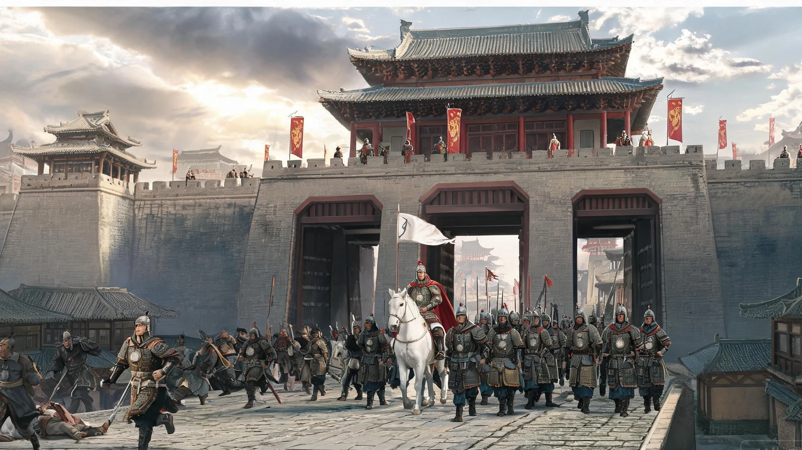 收复两京 |
| 第四幕 | 758—759 | 河朔反复 |  史思明降而复叛 |
| 第五幕 | 760—763 | 天下渐定 |  史朝义被弑、安史平定 |

<p align="center">
  
  
  
  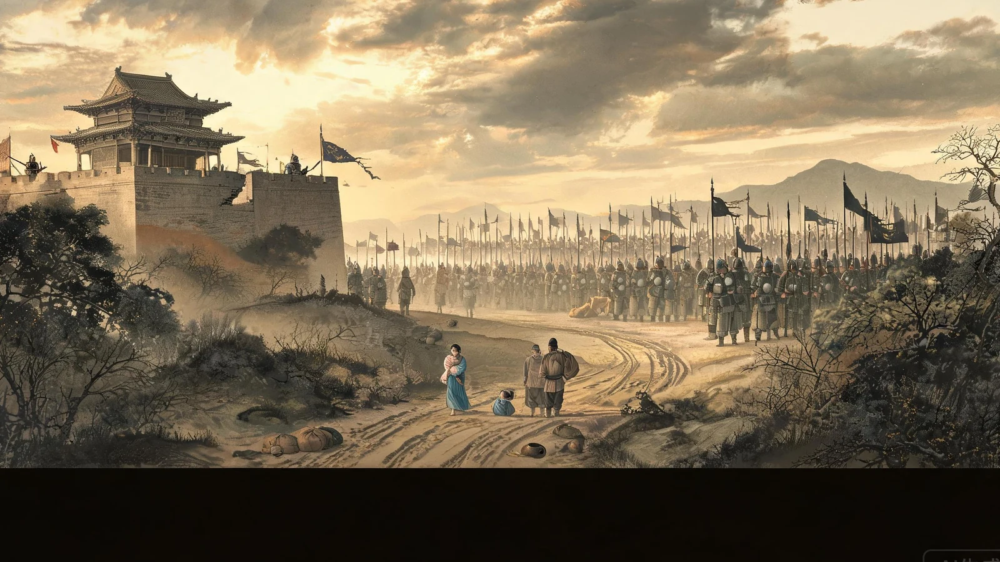
  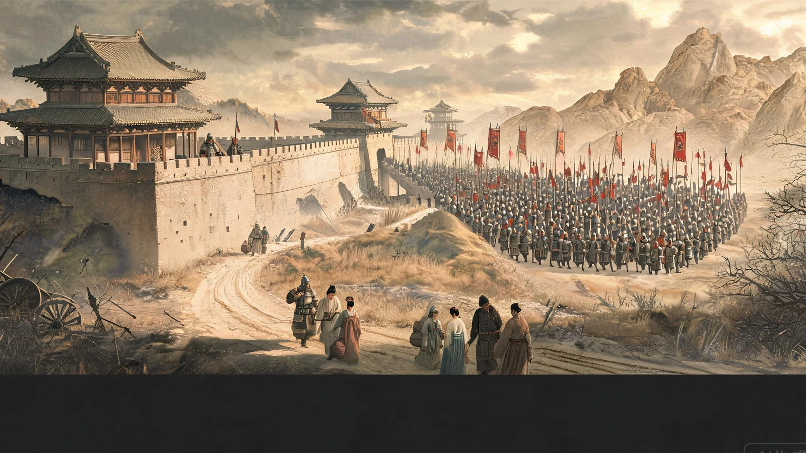
</p>

---

## 核心玩法

### 紫宸殿奏对

<p align="center">
  
  
</p>

三种场景，人物表现不同：

- **朝堂**：顾及官位、名分、派系与在场同僚
- **密诏**：谈不宜公开的判断，关系与承诺跨回合保留
- **远奏**：只能基于地方见闻回答，会承认消息迟滞

### 廷议集议

<p align="center">
  
</p>

选二至六人入殿，**单次 LLM 调用生成整场廷议**。模型编排谁发难、谁打断、谁回嘴、谁补台、谁逼皇帝裁断。后发言者会读取前臣意见，在人设和利益约束下附和或反驳。

### 御笔拟诏

<p align="center">
  
  
</p>

自由写下旨意 → 文书模型润色为唐廷风格圣旨 → 拆解为可校验的朝堂行动 → 中书核议 → 颁诏并推进。

### 军令调度

<p align="center">
  
</p>

16 地区地图、军队调动、会战、围城、补给。军令先入队，颁诏时统一执行。

### 国策经略

<p align="center">
  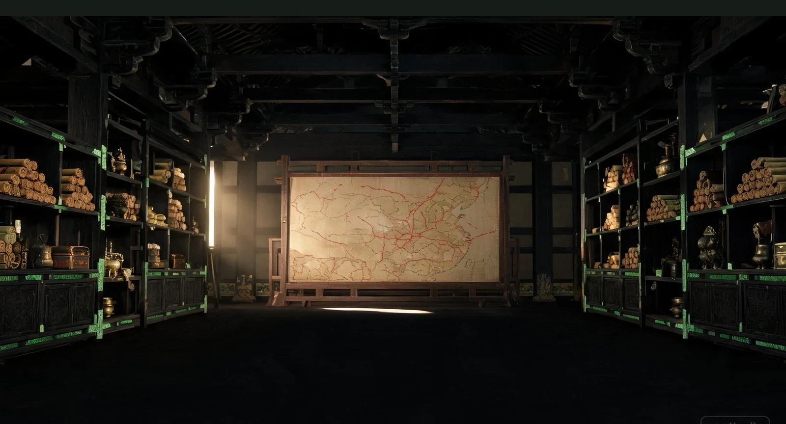
</p>

四大国策分支：中枢整饬、军镇经略、河朔联络、财赋民生。每回合最多推进一项，完成后写入帝国修正。

---

## 43 位人物

<p align="center">
  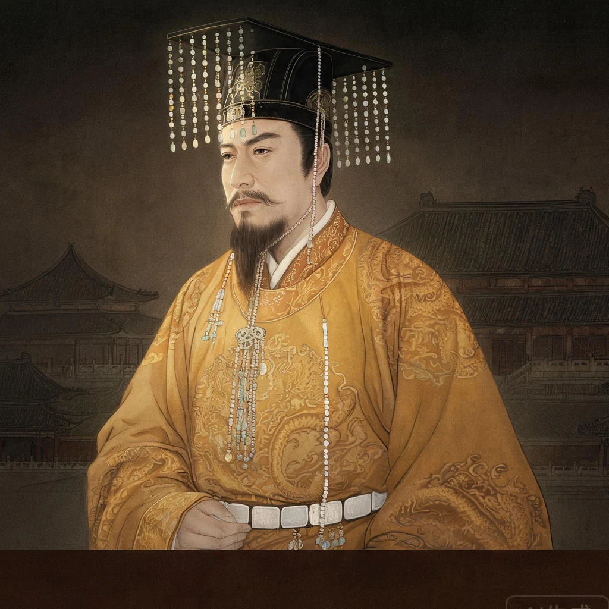
  
  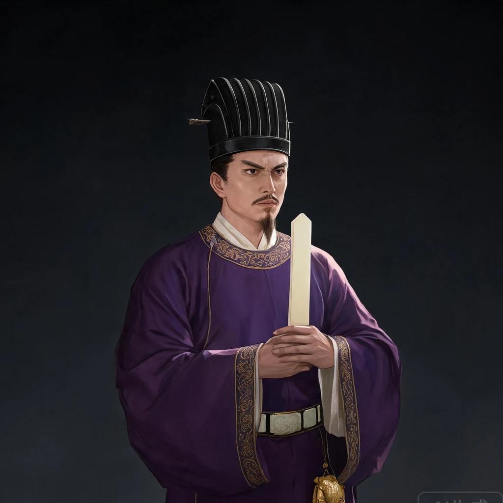
  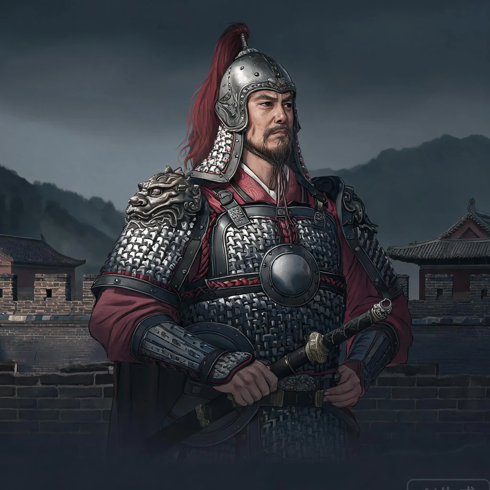
  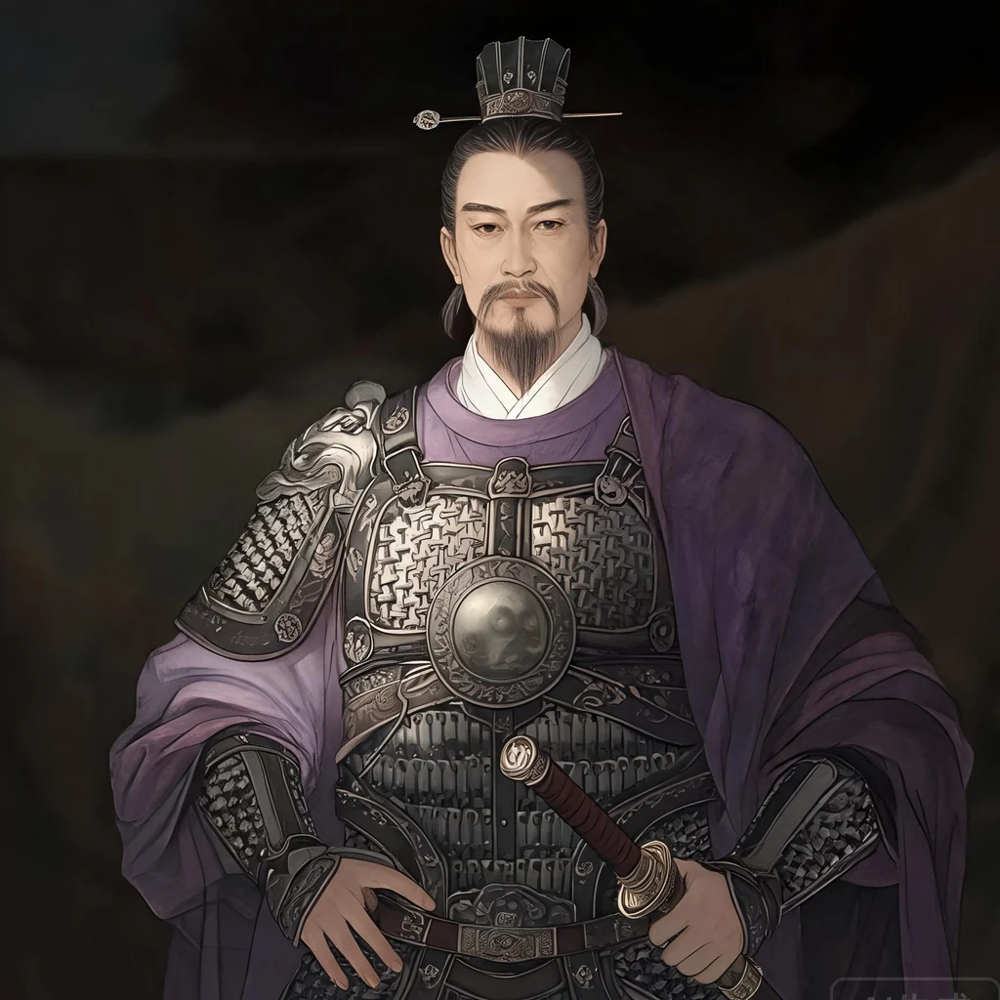
  
  
  
  
  
  
  
</p>

<p align="center">
  
  
  
  
  
  
  
  
  
  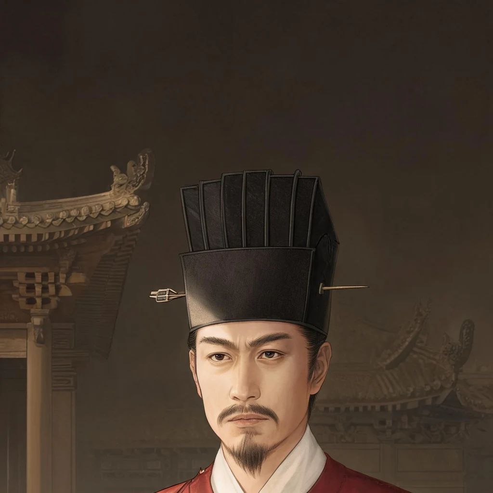
  
  
</p>

覆盖三省六部、禁军、边镇、燕廷。

---

## 事件画廊

<p align="center">
  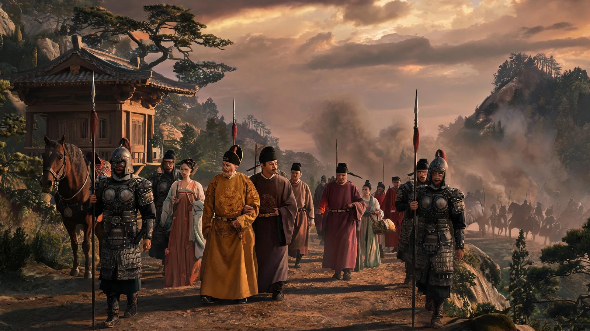
  
  
</p>

<p align="center">
  
  
  
</p>

<p align="center">
  
  
  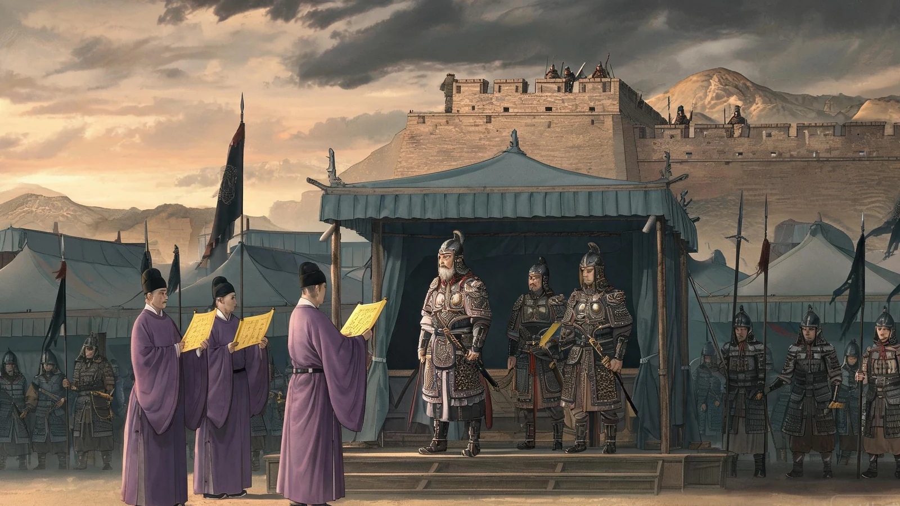
</p>

共 16 张事件插图，覆盖五幕关键节点。

---

## 推演架构

```
确定性规则（兵力、钱粮、路线、战斗）
  → 推演模型（JSON 提案 + 邸报叙事）
    → 本地校验器（白名单、目标、幅度）
      → 允许写入（民心、动乱、士气、补给、忠诚）
      → 拒绝写入（越权、无效、超限变化）
        → 史官纪事与自动存档
```

邸报以小说叙事风格生成，在推演的同一次 LLM 调用中产出，串联本回合的诏令施行、军事动向与天下大势。

---

## 技术栈

| 层 | 技术 |
|---|---|
| 前端 | React 19 + TypeScript + Vite |
| 后端 | Python 3.13 + FastAPI |
| AI 层 | Agent 工厂 + 流式 SSE + 供应商自动适配 |
| 存储 | SQLite WAL |
| 模型 | OpenAI 兼容协议 |

---

## 快速启动

```bash
# 安装
python -m pip install -e .
cd apps/web && npm install && cd ../..

# 配置（.env 文件）
OPENAI_API_KEY=your-key
OPENAI_BASE_URL=https://api.example.com/v1
OPENAI_MODEL=your-model

# 启动
python -m uvicorn apps.api.main:create_app --factory --port 8000
cd apps/web && npm run dev
```

Windows 一键启动：`powershell -ExecutionPolicy Bypass -File .\start.ps1 -Install`

---

## 测试

```bash
python -m pytest -q
# 64 passed
```

---

<p align="center">
  <em>渔阳鼙鼓动地来，潼关以东尽为战场。</em>
</p>
